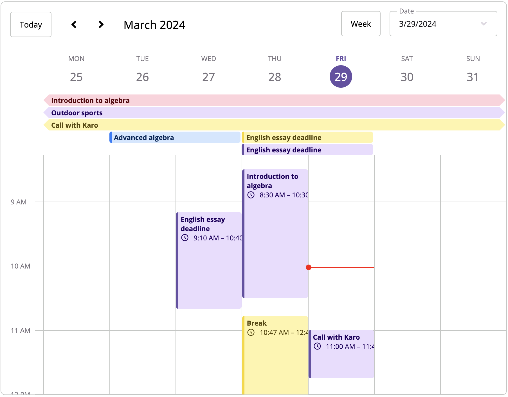

# Current time indicator

This plugin adds a current time indicator to the calendar. It will automatically update every minute.



## Install

```bash copy
npm i @schedule-x/current-time
```

## Usage

```js
import { createCurrentTimePlugin } from '@schedule-x/current-time'

const calendar = createCalendar(
  {
    /* calendar config */
  },
  [createCurrentTimePlugin()]
)
```

## Configuration

```js
createCurrentTimePlugin({
  // Whether the indicator should be displayed in the full width of the week. Defaults to false
  fullWeekWidth: true,

  // Time zone offset in minutes. Can be any offset valid according to UTC (-720 to 840)
  timeZoneOffset: 120,
})
```
